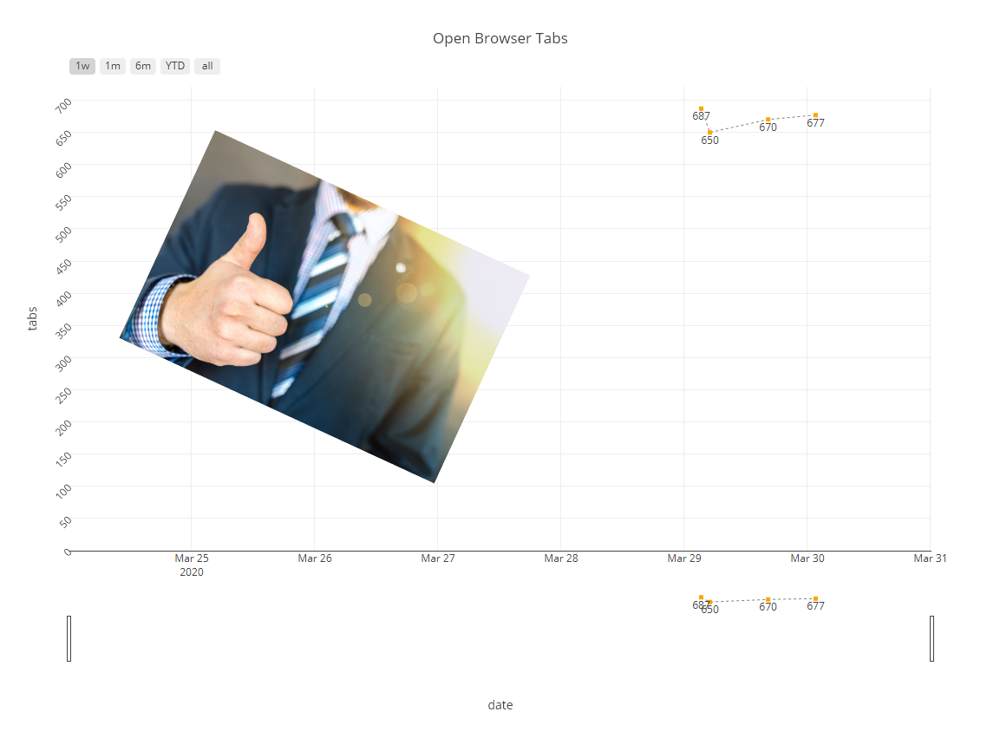

# Browser Tab Stats

Visit https://www.williamkarnavas.com/opentabs/ !


*Photo by Lukas from Pexels*

Create a live report of how many tabs you have open and put it online!

Compare with your friends!

Do you have what it takes to open the most browser tabs???

## BrowserTabArchiver


Records a time-series database of all the tabs you leave open in your Firefox browser from recovery.jsonlz4 into SQLite.

Run regularly from cron or Windows Task Scheduler!

Logs errors, and optionally pushes notifications to your phone using the awesome and dockerized server app [Gotify](https://gotify.net/) so that you can correct issues with minimal archiving disruption. (Supply your gotify address and a new app key).

After the data is recorded into SQLite, `updateStaticPageData.py` queries the numTabs column and puts it into a data file to upload to your website.


### How to extend for Chrome

The following 4 files are simliar to recovery.jsonlz4:

* Current Tabs
* Current Session
* Last Tabs
* Last Session

They can be parsed using a project called Chromegnon which runs in Python 2.7.

```
git clone https://github.com/JRBANCEL/Chromagnon.git
git checkout origin/SNSS
C:\Python27\python.exe chromagnonSession.py "Last Session"
```

... this prints the restore session commands to the console if the "Last Session" file is in the current folder. There is also programmatic access to build into this project in the future if wanted.

useful resource: https://softwarerecs.stackexchange.com/questions/19500/tool-to-read-data-from-google-chrome-snss-files

## Installation

Tested with Python 3.7

*Optionally: set up and activate a venv named BrowserTabArchiverVenv inside the /BrowserTabArchiver/ folder of this repo. Then you can call runBrowserTabArchiver.bat from a scheduled task on Windows every day.*

At a command line:

```
pip install requirements.txt
```

Fill out `configTemplate.json` with the appropriate values and save as `config.json`. (If on windows, replace backslashes with slashes, \ changes to /).

Run using `python archiveBrowswerTabs.py`

## Website Setup

I hosted the static website on Amazon AWS S3 easily and for free following [this article](https://medium.com/@channaly/how-to-host-static-website-with-https-using-amazon-s3-251434490c59).

Be sure to set the default time to live on all the resources for the graph website to be pretty short and not the default entire day.

### Database Scheme

In SQLite file data/tabArchive.db:

TABLE: ArchivedTabs

* snapshotID
  * generate this UUID each time you check the profile
* title
  * /windows[#]/tabs[#]/entries[ (/windows/[#]/tabs[#]/index) ]/title
* url
  * /windows[#]/tabs[#]/entries[ (/windows/[#]/tabs[#]/index) ]/url
* tabID
  * /windows[#]/tabs[#]/entries[ (/windows/[#]/tabs[#]/index) ]/ID
* tabWindow 
  * (starts at 0)
  * /windows[THIS]
* tabIndex
  * (starts at 0)
  * /windows[#]/tabs[THIS]
* lastAccessed
    * /windows[#]/tabs[#]/lastAccessed

TABLE: ArchiveSnapshots

* snapshotID
* snapshotTime
  * From the current system clock in UNIX time
* numWindows
* numTabs
* numTabsInLargestWindow
* sessionUpdatedTime
    * CHECK /session/lastUpdate to ensure that this file is being updated as expected
    * send issues to gotify

## Credits

This project licensed under the MIT License. See LICENSE.txt

mozlz4a.py (Mozilla session file extraction tool) provided under the BSD 2-clause license. Modified import on line 33. https://gist.github.com/Tblue/62ff47bef7f894e92ed5

New Tab Icon from IconsMind at iconsmind.com, https://iconsmind.com/classic-license/ (attribution required for free use, link to website https://iconsmind.com)