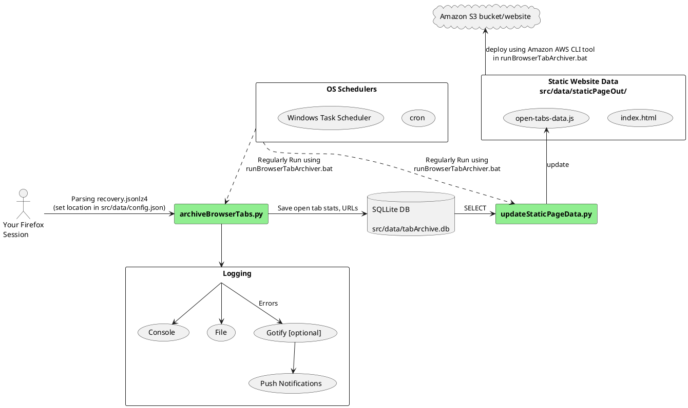

```plantuml
@startuml
rectangle "**archiveBrowserTabs.py**" as bta #lightgreen

"Your Firefox\nSession" as session
session -> bta: Parsing recovery.jsonlz4\n(set location in src/data/config.json)

rectangle "OS Schedulers" as sched {
    (cron)
    (Windows Task Scheduler)
}

rectangle "Logging" as btalog {
    btalog --> (Console)
    btalog --> (File)
    btalog --> (Gotify [optional]): Errors
    (Gotify [optional]) --> (Push Notifications)
}

sched ..> bta: Regularly Run using\nrunBrowserTabArchiver.bat
bta --> btalog

database "SQLLite DB\n\nsrc/data/tabArchive.db" as db
bta -> db: Save open tab stats, URLs

rectangle "Static Website Data\nsrc/data/staticPageOut/" as res {
    (index.html)
    (open-tabs-data.js) as data
}

rectangle "**updateStaticPageData.py**" as update #lightgreen
db -> update: SELECT
data <-- update: update
sched ..> update: Regularly Run using\nrunBrowserTabArchiver.bat

cloud "Amazon S3 bucket/website" as s3
s3 <-- res: deploy using Amazon AWS CLI tool\nin runBrowserTabArchiver.bat

@enduml
```