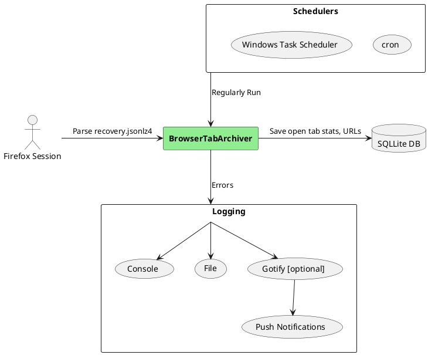

```plantuml
@startuml
rectangle "**BrowserTabArchiver**" as bta #lightgreen

"Firefox Session" as session
session -> bta: Parse recovery.jsonlz4

rectangle "Schedulers" as sched {
    (cron)
    (Windows Task Scheduler)
}

rectangle "Logging" as btalog {
    btalog --> (Console)
    btalog --> (File)
    btalog --> (Gotify [optional])
    (Gotify [optional]) --> (Push Notifications)
}

sched --> bta: Regularly Run
bta --> btalog: Errors

database "SQLLite DB" as db
bta -> db: Save open tab stats, URLs

@enduml
```